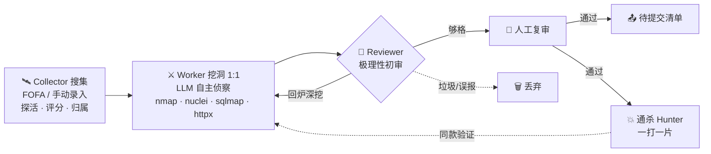

<div align="center">


### 多 Agent 协同 · 24×7 自动挖洞 · 人工只做复审决策

`锁定 · 侦察 · 出洞`

[](https://github.com/StanleyNull/AutoHunter/stargazers)
[](https://github.com/StanleyNull/AutoHunter/network/members)
[](https://github.com/StanleyNull/AutoHunter/issues)
[](https://github.com/StanleyNull/AutoHunter/commits)


**一台机器 = 24×7 不停歇的挖洞平台。你只当「人工复审员」，醒来几分钟完成裁决。**

<br>

### Contributors

<div align="center">

<table>
  <tr>
    <td align="center" width="100">
      <a href="https://github.com/StanleyNull">
        <br />
        <sub><b>StanleyNull</b></sub>
      </a><br /><sup>Author</sup>
    </td>
    <td align="center" width="100">
      <a href="https://github.com/bitter999">
        <br />
        <sub><b>bitter999</b></sub>
      </a><br /><sup>Engines</sup>
    </td>
    <td align="center" width="100">
      <a href="https://github.com/Star-233">
        <br />
        <sub><b>Star-233</b></sub>
      </a><br /><sup>Agent UX</sup>
    </td>
    <td align="center" width="100">
      <a href="https://github.com/2234223561">
        <br />
        <sub><b>2234223561</b></sub>
      </a><br /><sup>Agent UX</sup>
    </td>
    <td align="center" width="100">
      <a href="https://github.com/SD9ard3n">
        <br />
        <sub><b>SD9ard3n</b></sub>
      </a><br /><sup>LLM Pool</sup>
    </td>
    <td align="center" width="100">
      <a href="https://github.com/YiKongk">
        <br />
        <sub><b>YiKongk</b></sub>
      </a><br /><sup>FOFA API</sup>
    </td>
  </tr>
</table>

<table>
  <tr>
    <td align="center" width="100">
      <a href="https://github.com/1diot9">
        <br />
        <sub><b>1diot9</b></sub>
      </a><br /><sup>Workdir Cleanup</sup>
    </td>
    <td align="center" width="100">
      <a href="https://github.com/qianchongceng0-cyber">
        <br />
        <sub><b>qianchongceng0</b></sub>
      </a><br /><sup>Contributor</sup>
    </td>
    <td align="center" width="100">
      <a href="https://github.com/jacketser">
        <br />
        <sub><b>jacketser</b></sub>
      </a><br /><sup>Activity Stream</sup>
    </td>
    <td align="center" width="100">
      <a href="https://github.com/DmcforSpc">
        <br />
        <sub><b>DmcforSpc</b></sub>
      </a><br /><sup>Kimi Code</sup>
    </td>
    <td align="center" width="100">
      <a href="https://github.com/moliyu1101">
        <br />
        <sub><b>moliyu1101</b></sub>
      </a><br /><sup>DNS Probe</sup>
    </td>
    <td align="center" width="100">
      <a href="https://github.com/Saide-sec">
        <br />
        <sub><b>Saide-sec</b></sub>
      </a><br /><sup>Frontend UX</sup>
    </td>
  </tr>
</table>

<table>
  <tr>
    <td align="center" width="100">
      <a href="https://github.com/tf748i5gf5t">
        <br />
        <sub><b>tf748i5gf5t</b></sub>
      </a><br /><sup>Reviewer Fix</sup>
    </td>
    <td align="center" width="100">
      <a href="https://github.com/LLYHXX">
        <br />
        <sub><b>LLYHXX</b></sub>
      </a><br /><sup>List Pinning</sup>
    </td>
  </tr>
</table>

</div>

<br>

<sub>
完整名单与加入方式 → <a href="CONTRIBUTORS.md">如何成为 Contributor</a>
（有 commit 合进 <code>main</code> 的也会出现在
<a href="https://github.com/StanleyNull/AutoHunter/graphs/contributors">GitHub Contributors</a>）
</sub>

<br><br>

---

<br>

[快速开始](#快速开始) · [功能亮点](#功能亮点) · [创建任务](#创建任务) · [配置](#必填与推荐配置) · [运维](#运维与长期运行) · [避坑](#注意事项与避坑) · [Contributors](CONTRIBUTORS.md)


Powered By **StanleyNull** · 作者 EduSRC 主页：<https://src.sjtu.edu.cn/profile/46491/>

<br>


<sub>战绩可查</sub>

</div>

> [!WARNING]
> **仅限对已获明确书面授权的目标使用。** 本工具遵循 CC BY-NC 4.0，禁止任何商业用途，滥用后果自负。
还有，本工具做了删除限制，但是仍有可能在某些外部情况如模型自主意愿等情况下修改或删除少量数据，本工具造成的一切后果请后果自负，请在完全了解的情况下使用!使用本工具出现的问题可以提出意见我来修改，但请不要怪到我本人或者我们团队🤔

> [!NOTE]
> 🌱 本项目为 **Demo 级别**，作者抛砖引玉，欢迎 Star / Issue / 二次开发。

---

## 目录

- [这是什么](#这是什么)
- [功能亮点](#功能亮点)
- [快速开始](#快速开始)
- [创建任务](#创建任务)
- [必填与推荐配置](#必填与推荐配置)
- [运维与长期运行](#运维与长期运行)
- [注意事项与避坑](#注意事项与避坑)
- [技术栈](#技术栈)
- [贡献与反馈](#贡献与反馈)
- [如何成为 Contributor](CONTRIBUTORS.md)
- [许可协议](#许可协议)

---

## 这是什么

**AutoHunter** 是一个多 Agent 协同的自动化漏洞挖掘系统。你把一台机器交给它当作 7×24 小时不停歇的挖洞平台，自己只做「人工复审员」——AI 初审去掉垃圾洞后，你几分钟内完成调级 / 通过 / 打回 / 编辑 / 标记提交。



- **Collector**：从 FOFA 持续产出目标，探活、预筛、评分、归属标注后入队。
- **Worker**：每个目标一个 Worker，LLM 自主侦察 + 调用真实工具链挖洞，出洞即提交。
- **Reviewer**：极理性 AI 初审，过滤半成品 / 误报，只把够格的洞送到人工面前。
- **控制台**：实时看板一眼看清每个 Worker 在干什么、目标优先级、事件流；结果区高效复审、编辑、标记提交。

---

## 功能亮点

| | |
|---|---|
| 🤝 **多 Agent 协同** | Collector / Worker / Reviewer / 通杀 / 扩大危害 全流水线自动跑 |
| 🌙 **24×7 无人值守** | 挂机过夜，重启自动续跑；你醒来只做复审决策 |
| 🔧 **真实工具链挖洞** | 容器内置 nmap · nuclei · sqlmap · httpx · whatweb，LLM 真实发包/执行，不是纸上谈兵 |
| 🧪 **极理性 AI 初审** | 只认「实际可利用 + 实锤危害」，过滤半成品，减少无效人工复审 |
| 🏫 **归属离线反查** | 按 IP/域名离线查所属高校，自动填报告归属单位 + EduSRC 提交 JSON |
| 💥 **通杀 Hunter** | 出洞后自动分析能否「一打一片」，实打多个同款站点验证 |
| 🧠 **情报沉淀复用** | 验证过的凭证/端点/指纹入全局情报库，后续 Worker 直接复用 |
| 🛡️ **内置 WAF + 鉴权** | 应用层 WAF 默认开启，多角色访问令牌（全权/只读/观摩） |
| 💾 **数据库备份** | 设置页一键下载/恢复 SQLite（在线一致快照），可选打包工作目录，服务器定时留快照 |

---

## 快速开始

> [!TIP]
> 全程基于 **Docker + Docker Compose v2**，任意装得上 Docker 的系统都能跑。生产环境推荐 Linux（2C4G 起步，磁盘 ≥ 20G）。

```bash
# 1. 装 Docker（官方一键脚本，已装可跳过）
curl -fsSL https://get.docker.com | sh && sudo systemctl enable --now docker
sudo usermod -aG docker $USER && newgrp docker      # 免 sudo，重登生效

# 2. 拉代码 + 一键部署（交互式引导：填 LLM/FOFA Key → 自动生成令牌 → 构建启动）
git clone https://github.com/StanleyNull/AutoHunter.git autohunter && cd autohunter
bash scripts/install.sh
```

引导脚本会：检查 Docker → 引导填 **LLM API Key**（必填）、**FOFA Key**（推荐）→ 自动生成高强度访问令牌 → 构建镜像并启动 → 打印访问地址和令牌。

> 首次构建会编译前端 + 安装挖洞工具，约 **5–15 分钟**，请耐心等待。构建完浏览器访问 `http://<服务器IP>:18800/`，用打印出的令牌登录。

**开放端口**（默认 18800，云服务器还需在厂商安全组放行）：

```bash
sudo ufw allow 18800/tcp                                              # Ubuntu/Debian
sudo firewall-cmd --permanent --add-port=18800/tcp && sudo firewall-cmd --reload   # CentOS/RHEL
```

<details>
<summary><b>🪟 Windows（Docker Desktop + WSL2）</b></summary>

<br>

1. 管理员 PowerShell 装 WSL2：**必须装一个 Linux 发行版**（推荐 Ubuntu）。执行 `wsl --install`（或 `wsl --install -d Ubuntu`），装完重启。只开 Docker Desktop 自带的 `docker-desktop` 不够。
2. 装 [Docker Desktop](https://www.docker.com/products/docker-desktop/)，安装勾选 “Use WSL 2 based engine”。打开 **Settings → Resources → WSL Integration**，打开集成并**勾选 Ubuntu**。
3. 在 **Ubuntu 终端**（不要用空的 WSL 壳）里：
   ```bash
   git clone https://github.com/StanleyNull/AutoHunter.git autohunter && cd autohunter
   bash scripts/install.sh
   ```
4. 访问 `http://localhost:18800/`。

> 💡 代码放在 **WSL 文件系统内**（如 `~/autohunter`）比放 `C:\` 挂载盘性能好很多。只用 PowerShell 的话走下方手动部署。
>
> 国内拉 `node` / `python` 基础镜像失败时，在 Docker Desktop → Docker Engine 自行配置 `registry-mirrors`（第三方加速地址经常失效，不要写死进项目）。
>
> 仓库脚本已强制 LF。若你是从 zip 解压到 Windows 再 build，镜像构建时会自动去掉 `\r`，不必再手动 dos2unix。

</details>

<details>
<summary><b>🍎 macOS（Docker Desktop）</b></summary>

<br>

1. 装 [Docker Desktop for Mac](https://www.docker.com/products/docker-desktop/)（Apple Silicon / Intel 均支持）并启动。
2. `git clone https://github.com/StanleyNull/AutoHunter.git autohunter && cd autohunter && bash scripts/install.sh`
3. 访问 `http://localhost:18800/`。

</details>

<details>
<summary><b>🔧 手动部署（不用 install.sh）</b></summary>

<br>

```bash
cp .env.example .env
# 编辑 .env：至少填 LLM_API_KEY；建议填 FOFA_KEY 和 AUTOHUNTER_API_TOKEN
vim .env

docker compose up -d --build
docker compose logs -f autohunter   # 看启动日志
```

启动后访问 `http://<服务器IP>:18800/`，用 `.env` 里设置的 `AUTOHUNTER_API_TOKEN` 登录。

</details>

---

## 创建任务

登录控制台 → 「新建挖掘任务」，各字段含义：

| 字段 | 填什么 | 说明 |
|------|--------|------|
| **任务名称** | 随便起，方便区分 | 如 `edu批量挖掘-2026` |
| **任务模式** | `EduSRC` / `企业SRC` | 决定评分口径和审核标准，教育资产选 EduSRC |
| **漏洞类型** | 逗号分隔 | 默认 `sql_injection,rce,unauthorized_access,idor,file_upload,captcha_bypass,backdoor_compromised`，一般不用改 |
| **目标来源** | `FOFA 自动搜` / `手动清单` / `两者` / `单站协作` | 想让它自己找目标就选 FOFA |
| **搜集方式** | `自动判断` / `FOFA 语法` / `自然语言意图` | 见下方 |
| **FOFA 语法 / 搜集意图** | 查询语句或大白话 | 见下方示例 |
| **手动目标清单** | 每行一个 URL | 选「手动/两者/单站」时填 |

### 两种搜集方式

**① 会写 FOFA 语法** → 选 `FOFA 语法`，直接粘语句。例如挖教育网（CERNET）下带「管理」后台的资产：

```text
body="管理" && org="China Education and Research Network Center"
```

**② 不会写语法，只想说要找什么** → 选 `自然语言意图`，用大白话描述，搜集 Agent 自动翻译成 FOFA 语法并逐轮演化：

```text
找全国高校的统一身份认证登录系统
找某集团的 OA / CRM / ERP / API 网关 / 运维后台资产
```

> 留空「搜集方式」= **自动判断**（写得像语法就当语法，否则当意图），新手直接用这个。

### FOFA 语法速查

| 字段 | 含义 | 示例 |
|------|------|------|
| `title=` | 网页标题 | `title="后台管理"` |
| `body=` | 网页正文包含 | `body="管理"` |
| `domain=` | 域名 | `domain=".edu.cn"` |
| `host=` | 主机名 | `host="admin.example.com"` |
| `org=` | 所属机构（归属收窄利器） | `org="China Education and Research Network Center"` |
| `cert.subject.org=` | 证书机构 | `cert.subject.org="某某大学"` |
| `port=` / `country=` | 端口 / 国家 | `port="8080" && country="CN"` |

组合逻辑：`&&`（且）、`||`（或）、`!=`（非）。**语句越精确、归属越收窄，Worker 越不会打到范围外资产。**

任务里还可把搜索引擎换成 **360 Quake / Hunter / ZoomEye / Shodan / Censys**（设置页配对应 Key）。查询框两种写法都认：

1. **FOFA 语法**（推荐统一这么写）→ 请求前自动翻译到当前引擎
2. **该引擎官网原生语法** → 识别后原样请求，不再二次翻译

| 引擎 | 原生示例 | Key |
|------|----------|-----|
| 360 Quake | `title:"登录" AND domain:"edu.cn"` | `QUAKE_KEY`（个人中心 API Token） |
| Hunter | `web.title="登录" && domain.suffix="edu.cn"` | `HUNTER_KEY` |
| ZoomEye | `title="login" && country="CN"` | `ZOOMEYE_KEY` |
| Shodan | `http.title:"nginx" port:443` | `SHODAN_KEY`（需 Search API 权限） |
| Censys | `host.dns.names: edu.cn` | `CENSYS_KEY`（Platform Personal Access Token；旧账号才用 `API_ID:SECRET`） |

> 选了 Quake 却从官网粘 `title:"xxx" AND ...` 时，请把搜集方式设为「查询语法」或保持自动判断——系统会按原生语法直发，不再当成自然语言改写。

> [!IMPORTANT]
> **务必收窄授权范围**：只搜你有权限测试的资产。`org` / `domain` / `cert` 是最有效的归属过滤手段。

展开「高级」还可**按任务单独覆盖**：模型 `base_url`/`api_key`/模型名、FOFA key、FOFA 最大页数、Worker 并发数。不填就继承「设置」页全局默认。

---

## 必填与推荐配置

| 变量 | 必填 | 说明 | 获取方式 |
|------|:---:|------|---------|
| `LLM_API_KEY` | ✅ **必填** | 大模型 API Key，平台核心 | [DeepSeek](https://platform.deepseek.com/) / OpenAI / Claude / 通义 / Kimi 等 |
| `LLM_BASE_URL` | 默认 DeepSeek | 模型接口地址（OpenAI 兼容一般含 `/v1`） | 默认 `https://api.deepseek.com/v1` |
| `LLM_MODEL` | 默认 deepseek-chat | 模型名（推荐支持 tool calling；不支持也能用，见 `AUTOHUNTER_TOOL_COMPAT`） | 按厂商填写 |
| `LLM_PROTOCOL` | 默认 `auto` | `auto` / `openai_chat` / `anthropic_messages` | 控制台「设置」也可改 |
| `AUTOHUNTER_TOOL_COMPAT` | 默认 `auto` | 工具调用兼容：`auto` 原生优先、硬报错自动切提示词模拟；`prompt` 强制模拟（哑模型用）；`native` 仅原生 | 模型不支持 function calling 时改 `prompt` |
| `FOFA_KEY` | ⭐ 推荐 | 资产测绘，自动搜集目标 | [FOFA 个人中心](https://fofa.info/) |
| `FOFA_BASE_URL` | 可选 | 自定义 FOFA API 端点（私有/镜像/代理） | 默认 `https://fofa.info` |
| `AUTOHUNTER_API_TOKEN` | ⭐ 强烈建议 | 控制台全权限令牌，**不设则任何人可访问** | `install.sh` 自动生成，或自填随机串 |
| `AUTOHUNTER_HOST_PORT` | 默认 18800 | 对外访问端口 | 按需 |

> 其余参数（Worker 预算、并发、超时、WAF 等）都有合理默认，见 `.env.example` 注释按需微调。
> 也支持**不填 `.env`、直接在控制台「设置」页填 LLM/FOFA Key**——存进数据库，优先级高于 `.env`。

---

## 运维与长期运行

**常用命令**

```bash
docker compose logs -f autohunter     # 实时日志
docker compose restart autohunter     # 重启
docker compose down                    # 停止（数据保留在 volume）
docker compose up -d --build           # 更新代码后重建
```

数据持久化在 Docker volume：`ah_data`（SQLite + 漏洞证据）、`ah_work`（Worker 临时工作区）。**升级/重启不丢数据。**

**备份 / 迁移**：设置页「数据备份」可导出一致的 SQLite 快照（可选打包工作目录）并上传恢复，这是主路径。服务器默认不自动堆快照；若点「在服务器覆盖留一份」，只覆盖 `data/backups/autohunter-latest.db.gz` 这一份，空间不够会拒绝以免把库盘写满。不要用 `cp autohunter.db` 当备份——WAL 模式下直接拷文件很容易拷到半截库。

**开机自启**：`docker compose up -d` 的容器默认 `restart: unless-stopped`，崩溃/重启会自动拉起。若想托管给 systemd：

<details>
<summary><b>systemd unit 示例</b></summary>

<br>

```bash
sudo tee /etc/systemd/system/autohunter.service >/dev/null <<EOF
[Unit]
Description=AutoHunter
Requires=docker.service
After=docker.service

[Service]
Type=oneshot
RemainAfterExit=yes
WorkingDirectory=$(pwd)
ExecStart=/usr/bin/docker compose up -d --build
ExecStop=/usr/bin/docker compose down

[Install]
WantedBy=multi-user.target
EOF

sudo systemctl daemon-reload && sudo systemctl enable --now autohunter
```

</details>

**反向代理 + HTTPS**（可选，生产推荐）：前面挂 Nginx/Caddy 做域名 + TLS，把 `AUTOHUNTER_HOST_PORT` 只绑 `127.0.0.1` 不对公网直接暴露。Caddy 示例：

```caddyfile
hunt.example.com {
    reverse_proxy 127.0.0.1:18800
}
```

---

## 注意事项与避坑

> [!CAUTION]
> **授权边界**：只测你有权限的目标，FOFA 语法要收窄归属（域名/证书/org），别让 Worker 打到范围外资产。
> **访问控制**：公网部署**务必设 `AUTOHUNTER_API_TOKEN`**，否则控制台和挖洞能力对全网裸奔。内置 WAF 默认开启，但令牌是第一道门。

- **成本控制**：Worker 靠 LLM 驱动，目标越多 token 越贵。用 `.env` 的 `WORKER_MAX_ROUNDS` / `*_BUDGET_CAP` 收紧预算，或降低并发。
- **资源**：默认按 CPU/内存自动定 Worker 并发（约 1C1G→3，2C4G→8，大机器顶 32），Docker 会读 cgroup 限额。复制 `.env.example` 不必再填线程池。要强制用 `AUTOHUNTER_WORKER_MAX_CONCURRENCY`；每个 Worker 会跑真实工具子进程，小机器把任务并发也调低。
- **网络**：服务器需能访问 LLM API 和目标网络；走代理要给 Docker/容器配好出网。
- **重启恢复**：`AUTOHUNTER_RESTORE_ON_STARTUP=1` 时重启自动续跑之前 running 的任务；受限机器设 `0` 只起 Web/API。

---

## 技术栈

| 层 | 选型 |
|---|---|
| 后端 | Python 3.12 · FastAPI · SQLAlchemy(SQLite) · asyncio |
| 前端 | Vue 3 · Vite |
| 模型 | 推荐支持 **tool calling**；协议为 OpenAI Chat Completions 或 Anthropic Messages（`LLM_PROTOCOL=auto` 可自动识别）。**不支持原生工具调用的模型也能用**：`AUTOHUNTER_TOOL_COMPAT=auto`（默认）会在端点不支持 tools 时自动切换到「提示词模拟工具调用」，哑模型可设 `prompt` 强制模拟。常见：DeepSeek / OpenAI / Claude / 通义 / Kimi 等 |
| 工具链（容器内置） | nmap · nuclei · sqlmap · httpx · whatweb · curl/wget/jq |

---

## 贡献与反馈

- 🐛 发现 bug / 有建议 → 提 [Issue](https://github.com/StanleyNull/AutoHunter/issues)
- ⭐ 觉得有用 → 点个 Star 支持一下
- 🔀 欢迎 Fork 二次开发（保留署名、非商业用途）
- 🙋 想出现在首页 Contributors → 按 [CONTRIBUTORS.md](CONTRIBUTORS.md) 自行申请（开 PR 即可）

---

## 许可协议

本项目采用 **[CC BY-NC 4.0](./LICENSE)**（署名-非商业性使用）：

- ✅ 可自由使用、修改、二次分发
- ✅ **必须保留原作者署名**：`Powered By StanleyNull`
- ❌ **禁止任何商业用途**

---

<div align="center">

**Powered By StanleyNull**

*仅供授权安全测试与研究 · 请遵守当地法律法规*

</div>
